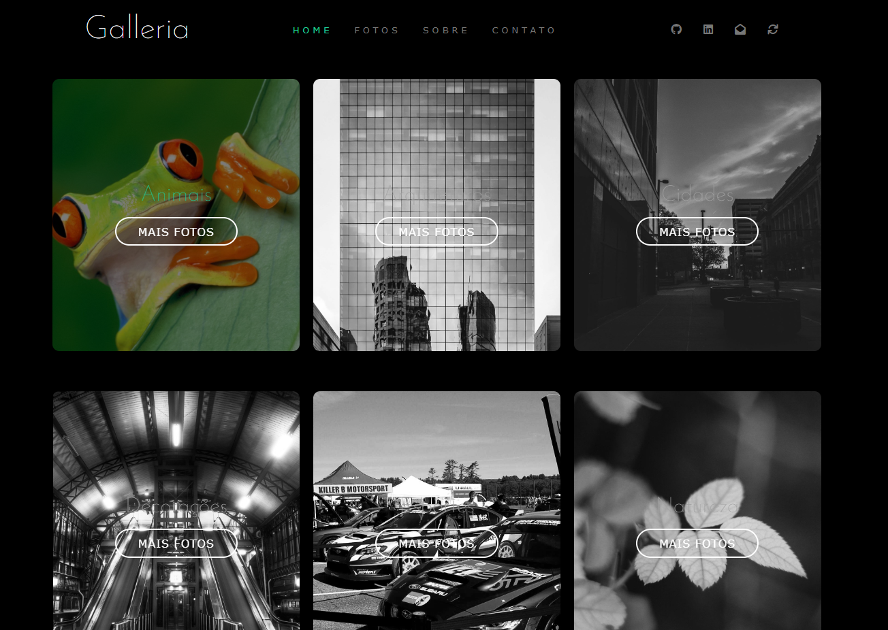

#

> Trata-se de um website totalmente feito por mim, para fortalecer meu portfólio.

Confira a aplicação: <a href="https://a-galleria.vercel.app/index.html" target="_blank"> Galleria <a/>

## 🚀 Tecnologias
Este projeto foi desenvolvido com as seguintes tecnologias:
    
- [x] HTML
- [x] SASS
- [x] JavaScript
- [x] JavaScript
- [x] JQUERY

## 🤝 Colaborador(es)
Desenvolvedor(es):

<table>
  <tr>
    <td align="center">
      <a  align="center" href="#">
         
        
          <b>Samuel Pereira Brandão</b>
        
      </a>
    </td>
    
</table>
    
  
💬 Quer entrar em contato?
   
  
  

♥ by Samuel Pereira Brandão :wave: <a href="https://github.com/SamuelPereiraBrandao">Entrar em contato!</a>
